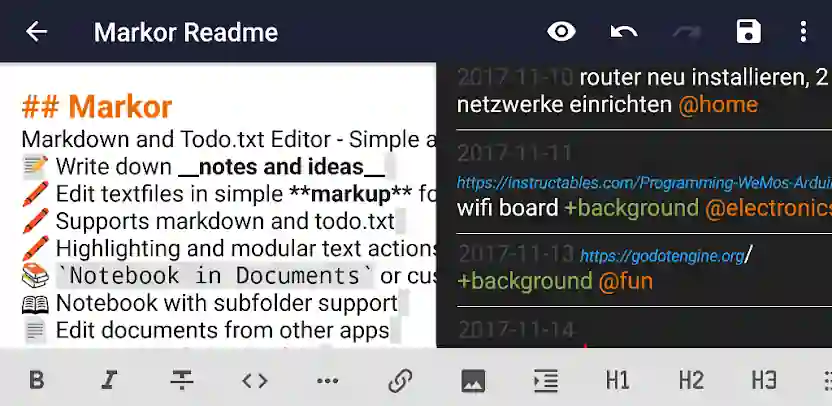
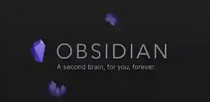

## Android

### Markor

Text editor - Notes & ToDo. Lightweight. Markdown and todo.txt support.
📝 Create notes and manage your to-do list using simple markup formats
🌲 Work completely offline - whenever, wherever
👌 Compatible with any other plaintext software on any platform -- edit with notepad or vim, filter with grep, convert to PDF or create a zip archive

[Ir a F-Droid](https://f-droid.org/en/packages/net.gsantner.markor)
[Ir a Playstore | normal ](https://play.google.com/store/apps/details?id=net.gsantner.markor)

### Obsidian

Obsidian is a powerful knowledge base that works on top of
a local folder of plain text Markdown files.

It is a second brain, for you, forever. Now available on the go for Android!

[Ir a Playstore | normal](https://play.google.com/store/apps/details?id=md.obsidian)

## Linux

Blabla 

## Windows

#### Writemonkey
WriteMonkey es una aplicación para escribir en Markdown que sigue adelante gracias a donaciones. Cuenta con una interfaz muy sencilla y que te permite escribir en modo _“máquina de escribir”_, esto es, manteniendo la línea de escritura siempre en el centro.

Con WriteMonkey no tendrás problema en escribir en Markdown, y exportar el resultado final a formato de texto enriquecido o HTML.

#### MarkdownPad 2
MarkdownPad 2 es una aplicación gratuita que tiene todo lo necesario para que puedas adentrarte en el mundo de Markdown. Gracias a su previsualización de HTML en directo podrás ver en todo momento el resultado final de aquello que estés escribiendo.

Podrás editar multiples documentos en diferentes pestañas, y hacerlo rápidamente gracias a los atajos de teclado que añaden la sintaxis de Markdown rápidamente.

MarkdownPad 2 cuenta con una versión de pago que te permitirá entre otras cosas: exportar el resultado final a PDF o activar el autoguardado.

#### MarkPad
MarkPad es un proyecto de un grupo de programadores llamado code52.

Algunas de las características más destacables de MarkPad son su vista previa lateral al lado del documento original, o un corrector ortográfico que incluye una **barra de herramientas flotante con toda la sintaxis de Markdown**.

#### MdCharm
MdCharm es **multiplataforma y gratuito**. Al igual que las aplicaciones anteriores, también cuenta con **previsualización en vivo** y capacidad de **exportar el contenido final a PDF o HTML**.

Como característica estrella encontrarás **soporte para MarkDown Extra y MultiMarkdown**.

## MacOS

#### Focused
Focused es un editor de texto desarrollado por Real Mac Software (responsables de otras grandes aplicaciones como RapidWeaver, Ember, o la archiconocida Clear)

La interfaz gráfica de Focused es minimalista. Esta aplicación te ofrece una hoja en blanco donde poder plasmar tus ideas y generar tu contenido **sin distracciones**. El único adorno que verás en toda la pantalla es un contador de palabras en la zona superior derecha.

Podrás acceder a un pequeño **menú oculto** posicionando el cursor en una **columna invisible a la izquierda de la ventana**, de esta forma verás aparecer tres iconos:

- **T:** para gestionar la fuente de tu texto y el color de fondo
- **Gafas:** un visualizador para descubrir cómo se vería tu contenido
- **Compartir:** para exportar Markdown a HTML, o enviar el resultado a otras aplicaciones (iMessages, Mail, AirDrop…)

#### Write
Write te ofrece una interfaz con una única ventana. En la primera columna tendrás acceso a los lugares donde hayas almacenado tus documentos (Dropbox, iCloud…), además de a una serie de etiquetas que te ayudarán con la organización de tu trabajo.

La columna central simplemente muestra los archivos para la ubicación seleccionada, mientras la gran columna de la derecha es el **panel de edición**, donde podrás **escribir y editar** el contenido de los archivos seleccionados en la columna anterior.

Write también cuenta con una versión para iPhone y una versión para iPad, aplicaciones que podrás utilizar para crear tu ecosistema escritor allá donde vayas.

#### Byword
Byword está diseñado para que tu escritura de Markdown en Mac sea lo más agradable posible.

Al igual que sucedía con Typed, Byword también cuenta con una interfaz minimalista; lo que no quita para que esté cuidada al máximo, incluyendo **atajos de teclado** para mejorar tu experiencia o un **modo oscuro** para mayor confort en situaciones de poca iluminación.

Con Byword también podrás exportar tus documentos a PDF y HTML, además de publicarlos directamente en WordPress, Tumblr, Blogger o Evernote, aunque para esto último necesitarás realizar una compra in-app.

Del mismo modo que sucedía con Write, Byword también cuenta con una versión móvil para que así puedas generar contenido fácilmente en Markdown desde cualquier dispositivo iOS.

#### nvALT
Con nvALT podrás tomar notas de una forma rápida y sin esfuerzo utilizando sólo el teclado. Simplemente inicia la aplicación y comienza a escribir, esto te permitirá buscar entre las notas existentes, o crear una nueva en la que poder generar contenido (escribiendo un título y pulsando <kbd>intro ↩</kbd>).

Haciendo click sobre la opción del menú llamada “preview” y eliges la opción “toggle preview window”, podrás lanzar un visualizador para observar en directo como luciría tu contenido una vez aplicado el formato de Markdown.

#### Marked 2
Marked no es realmente una aplicación para escribir en Markdown, sino que se trata de **un visualizador** que leerá cualquier tipo de archivo escrito en Markdown, y te lo mostrará tal y como se vería en un navegador.

Esta aplicación **se empareja con cualquier tipo de documento**, y te mostrará el resultado final conforme vayas actualizando su contenido.

Además de convertir cualquier procesador de texto plano en un sistema **WYSIWYG** (what you see is what you get = Lo que ves es lo que obtienes), Marked te permitirá exportar el documento final como HTML, PDF, o RTF (rich text format), o incluso Microsoft Word.

## Editores Online

#### Dingus
Dingus es la herramienta desarrollada por el propio John Gruber para trabajar con Markdown.

[Ir a Dingus](http://daringfireball.net/projects/markdown/dingus)